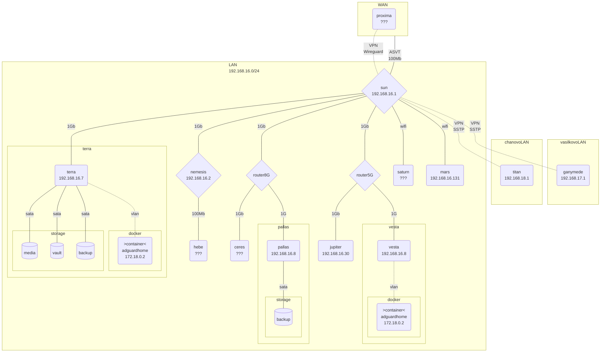

```mermaid
graph TD
    subgraph WAN
        proxima(proxima<br>???)
    end

    subgraph vasilkovoLAN
        ganymede(ganymede<br>192.168.17.1)
    end
    
    subgraph chanovoLAN
        titan(titan<br>192.168.18.1)
    end

    subgraph LAN [LAN<br>192.168.16.0/24]
        sun{sun<br>192.168.16.1}
        nemesis{nemesis<br>192.168.16.2}
        router8G{router8G}
        router5G{router5G}
        jupiter(jupiter<br>192.168.16.30)
        mars(mars<br>192.168.16.131)
        saturn(saturn<br>???)
        ceres(ceres<br>???)
        hebe(hebe<br>???)

        sun---|1Gb|terra
        sun---|1Gb|nemesis
        sun---|1Gb|router8G
        sun---|1Gb|router5G
        sun---|wifi|saturn
        sun---|wifi|mars
        nemesis---|100Mb|hebe
        router8G---|1Gb|ceres
        router5G---|1Gb|jupiter
    
        subgraph terraserver [terra]
            terra(terra<br>192.168.16.7)

            subgraph terrastorage [storage]
                media[(media)]
                vault[(vault)]
                backupmedia[(backup)]
            end
            terra---|sata|media        
            terra---|sata|vault
            terra---|sata|backupmedia
            
            subgraph terradocker [docker]
                adguardterra(>container<<br>adguardhome<br>172.18.0.2)
            end
            terra-.-|vlan|adguardterra
        end

        subgraph vestaserver [vesta]
            vesta(vesta<br>192.168.16.8)

            subgraph vestadocker [docker]
                adguardvesta(>container<<br>adguardhome<br>172.18.0.2)
            end
            vesta-.-|vlan|adguardvesta
        end
        router5G---|1G|vesta

        subgraph pallasserver [pallas]
            pallas(pallas<br>192.168.16.8)

            subgraph pallasstorage [storage]
                backuppallas[(backup)]
            end
            pallas---|sata|backuppallas
        end
        router8G---|1G|pallas

    end
    WAN---|ASVT<br>100Mb|sun
    proxima-.-|VPN<br>Wireguard|sun
    sun-.-|VPN<br>SSTP|titan
    sun-.-|VPN<br>SSTP|ganymede
```
